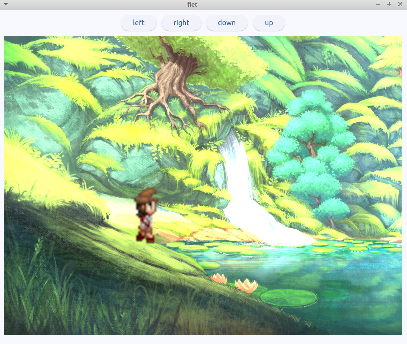

# flet animation demo with observable

Code for tutorial on using Flet 1.0 for animation games.



## Free Course

[Full Course on YouTube](https://youtube.com/playlist?list=PLxvyAnoL-vu5IAI2edc_OR5NAwDo8YEPl&si=3AbRp2K1JsN4PjP7)

1. [Flet 1.0 Python for Beginners Course Overview (Learn Python by Building Games) - Pepper 1](https://youtu.be/F2f98GhkKUA)
2. [Flet 1.0 Reactive State Management in Python - Pepper 2](https://youtu.be/e0krw8TrGII)
3. [Start Flet 1.0 Game With Background Graphics](https://youtu.be/hdQhcMid5D4)
4. [Python + Flet 1.0 Game Dev: Layered Backgrounds, Sprites, and Observable Game State](https://youtu.be/AyS3HWiEalE)
5. [Python + Flet State Management Explained: useState, Observable Classes, and Game Animation](https://youtu.be/RyUpdMONqN0) - Available Jan 5, 2026
6. [Python + Flet 1.0 Game Animation: Sprite Frames, Direction State, and Walking Animations](https://youtu.be/dKS-Nhf6OoY) - Available Jan 6, 2026
7. [Python + Flet 1.0: Add Direction Buttons (Up/Down/Left/Right) with State-Driven Re-Renders](https://youtu.be/Vi7LwQJiZG8) - Available Jan 7, 2026

[Course slides](docs/slides.md)

Note that the slides are using [Marp](https://marp.app/).

## Setup

This project uses `uv` for dependency management. To set up the project:

```bash
uv sync
```

This will install all dependencies defined in `pyproject.toml`.

## Running

To run the application:

```bash
flet main.py
```

## observable

ft.observable is a Flet decorator that makes a class reactive, so UI components automatically re-render when its properties change.

### How it works

When you mark a class with @ft.observable, Flet tracks changes to its properties. When a property changes, any component using that observable automatically re-renders.

```python
@ft.component
def GameView():
    state, _ = ft.use_state(GameState())  # state is observable

    # When state.sprite_x or state.direction changes,
    # this component automatically re-renders!
    sprite = ft.Container(
        left=state.sprite_x,  # Reads from observable
        ...
    )
```

## post_init

`__post_init__` is a special method in Python dataclasses that runs automatically after the dataclass-generated `__init__` completes.

### How post_init works

When you use @dataclass, Python generates an `__init__` that sets all the fields. `__post_init__` runs right after that, so you can add initialization logic.

In your code:

## Art

- [Pepper&Carrot](https://opengameart.org/content/24x32-peppercarrot-characters)
  - [Pepper & Carrot site](https://www.peppercarrot.com/en/)
  - other [24x32 sets](https://opengameart.org/art-search-advanced?field_art_tags_tid=24x32)
