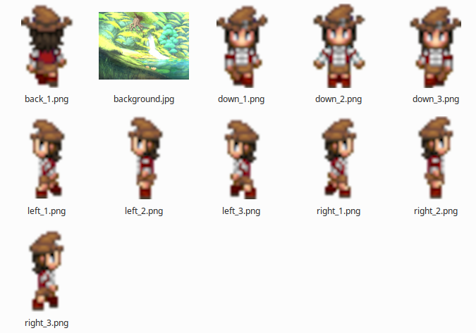

# Python and Flet Concepts for Beginners

## Pepper Tutorial

- UI development patterns
- Reactive programming concepts
- Flet's declarative UI approach
- MVC architecture

---

Concept inspired by Pepper&Carrot by David Revoy


---

# Observables: Reactive State Management

## What are Observables?

- **Observables** are objects that notify listeners when their values change
- When an observable property changes, the UI automatically updates
- This is called **reactive programming** or **data binding**

---

## Observable in Flet with `ft.observable`

```python
from dataclasses import dataclass
import flet as ft

@dataclass
@ft.observable
class GameState:
    direction: str = "right"
    sprite_x: int = 5
    sprite_y: int = 300
```

- The `@ft.observable` decorator makes the class reactive
- When you change `state.direction`, the UI automatically re-renders
- No manual UI updates such as `page.update()` needed

---



---

# Observables: Comparison with Flutter

## Flutter's Approach

Flutter doesn't have built-in observables. Developers use state management libraries:

**Riverpod Example:**

```dart
@riverpod
class GameState extends _$GameState {
  @override
  String build() => "right";
  
  void setDirection(String dir) {
    state = dir; // Automatic notification
  }
}
```

**BLoC Example:**

```dart
class GameBloc extends Bloc<GameEvent, GameState> {
  GameBloc() : super(GameState(direction: "right"));
  
  void setDirection(String dir) {
    emit(state.copyWith(direction: dir)); // Manual emit
  }
}
```

---

## Flet Difference with Flutter

**Key Differences:**

- Flutter requires **third-party libraries** (Riverpod, BLoC, Provider) for state management
- Flet has **built-in observables** with `@ft.observable` decorator
- Flutter's libraries often require manual state updates or event emissions
- Flet automatically detects changes to observable properties
- Flet's approach is simpler and requires less boilerplate

---

## Flet Observable (mutable) vs Riverpod (immutable)

**Flet (Mutable):**

- Direct property mutation: `state.sprite_x += 10`
- Same object instance, properties change
- Simpler, less boilerplate
- Built into Flet framework

**Riverpod (Immutable):**

- Create new state objects: `state.copyWith(...)`
- Each update creates a new instance
- More explicit, better for testing
- Requires third-party package

---

## Flutter Signals (Mutable-like)

- Direct signal updates: `spriteX.value += 10`
- Signals are reactive primitives
- Simpler than Riverpod, similar to Flet
- Third-party package (inspired by SolidJS)

---

# Flet Observable vs Riverpod: When to Use

## Flet Observable

**Best for:**

- Simple to medium complexity apps
- Direct property mutations
- Rapid prototyping
- Teaching basic games concepts (single sprite example)
- Less boilerplate needed

**Note:** For Flutter game development, developers typically use **Flame** (a game engine built on Flutter) rather than raw Riverpod for sprite animations and game loops.

---

## Flet Observable vs Riverpod vs Flutter Signals: Comparison

**All provide reactive state management, but with different patterns:**

**Flet Observable:**

```python
@ft.observable
class GameState:
    sprite_x: int = 5

state.sprite_x += 10  # Direct mutation, auto-updates UI
```

**Flutter Signals:**

```dart
final spriteX = signal(5);

spriteX.value += 10;  // Direct mutation, auto-updates UI
```

---

**Riverpod:**

```dart
state = state.copyWith(spriteX: state.spriteX + 10);  // Immutable update
```

**Key Differences:**

- **Flet**: Mutable objects, direct property access, built-in
- **Flutter Signals**: Mutable signals, direct value access, third-party (closest to Flet!)
- **Riverpod**: Immutable state, provider pattern, third-party
- **Flame** (Flutter games): Game engine with built-in sprite/animation systems

---

**For sprite motion app:**

- **Flet's observable** is simpler and more direct (built-in)
- **Flutter Signals** would be the closest equivalent - direct mutation like Flet
  - great practice opportunity
- **Riverpod** would require more setup (state classes, providers, copyWith)
  - you need to learn Riverpod or BLoC anyway with Flutter, so good practice
- **Flame** would handle sprites differently (component-based game objects)

**Note:** Flutter Signals is the most similar to Flet's observable pattern - both allow direct mutation with automatic UI updates!

---

# Observables: Comparison with React

## React's Approach

```jsx
const [direction, setDirection] = useState("right");

// Changing state triggers re-render
setDirection("left");
```

**Key Difference:**

- React uses hooks (`useState`) for component-level state
- Flet observables work at the class level, similar to state management libraries like Redux or MobX
- Flet observables can be shared across multiple components

---

# `ft.use_state`: Managing Component State

## What is `use_state`?

- `use_state` is a **hook** that manages state in Flet components
- It returns the current state and a setter function
- Similar to React's `useState` hook

---

# `ft.use_state`: Example

```python
@ft.component
def GameView():
    state, _ = ft.use_state(GameState())
    
    def on_left_click(e):
        state.set_direction("left")
        # UI automatically updates!
    
    return ft.Button("Left", on_click=on_left_click)
```

**How it works:**

1. `use_state` creates an instance of `GameState`
2. When `state.direction` changes, the component re-renders
3. The UI reflects the new state automatically

---

# `ft.use_state`: Key Points

## Important Concepts

- **State persists** between re-renders
- **Only the component** using `use_state` re-renders when state changes
- The second return value (setter) is optional if you modify the state object directly
- State is **local to the component** unless you pass it as props

---

# `ft.use_state`: Return Values

## Understanding the Tuple Return

```python
state, set_state = ft.use_state(GameState())
```

**Two return values:**

1. **State object**: The current state instance
2. **Setter function**: Optional function to replace the entire state

---

# `ft.use_state`: Using the Setter

## When to Use the Setter

```python
@ft.component
def Counter():
    count, set_count = ft.use_state(0)
    
    def increment(e):
        set_count(count + 1)  # Replace entire state
    
    def increment_direct(e):
        count += 1  # Won't work! Can't modify immutable types
    
    return ft.Button(f"Count: {count}", on_click=increment)
```

---

**Key Points:**

- Use setter for **immutable types** (int, str, tuple)
- For **mutable objects** (observable classes), modify directly
- Setter creates a **new state**, triggering re-render

---

# `ft.use_state`: Mutable vs Immutable State

## Mutable Objects (Observable Classes)

```python
@ft.component
def GameView():
    state, _ = ft.use_state(GameState())  # Setter not needed
    
    def move_left(e):
        state.sprite_x -= 10  # Direct mutation works!
        # Observable detects change automatically
    
    return ft.Button("Left", on_click=move_left)
```

---

**Why this works:**

- Observable classes detect property changes
- No setter needed for observable state objects
- Direct mutation triggers re-render

---

# `ft.use_state`: Mutable vs Immutable State

## Immutable Types (Primitives)

```python
@ft.component
def Counter():
    count, set_count = ft.use_state(0)  # Setter required
    
    def increment(e):
        set_count(count + 1)  # Must use setter
    
    return ft.Button(f"Count: {count}", on_click=increment)
```

---

**Why setter is needed:**

- Primitive types (int, str) are immutable
- Can't modify them directly
- Setter creates new value, triggering re-render

---


## Managing Multiple Pieces of State

```python
@ft.component
def GameView():
    state, _ = ft.use_state(GameState())
    count, set_count = ft.use_state(0)
    is_paused, set_paused = ft.use_state(False)
    
    def toggle_pause(e):
        set_paused(not is_paused)
    
    return ft.Column(
        controls=[
            ft.Text(f"Score: {count}"),
            ft.Button("Pause" if not is_paused else "Resume", 
                     on_click=toggle_pause)
        ]
    )
```

---

**Best Practice:**

- Use separate `use_state` calls for unrelated state
- Group related state in a single observable class

---

# `ft.use_state`: State Initialization

## Lazy Initialization

```python
@ft.component
def ExpensiveView():
    # This runs on EVERY render (bad!)
    state, _ = ft.use_state(expensive_computation())
    
    return ft.Column(...)
```

**Problem:**

- Initial value is computed on every render
- Can cause performance issues

---

# `ft.use_state`: State Initialization

## Lazy Initialization with Function

```python
@ft.component
def ExpensiveView():
    # This runs only ONCE (good!)
    state, _ = ft.use_state(lambda: expensive_computation())
    
    return ft.Column(...)
```

**Solution:**

- Pass a **function** instead of a value
- Function is called only once on first render
- Useful for expensive initializations

---

# `ft.use_state`: Common Pitfalls

## Pitfall 1: Modifying State in Render

```python
@ft.component
def BadExample():
    count, set_count = ft.use_state(0)
    
    # BAD: Modifying state during render
    count += 1  # Causes infinite loop!
    
    return ft.Text(f"Count: {count}")
```

---

**Why it's bad:**

- Component re-renders when state changes
- Re-render modifies state again
- Creates infinite loop

---

# `ft.use_state`: Common Pitfalls

## Pitfall 2: Not Using Observable for Complex State

```python
@ft.component
def BadExample():
    # BAD: Using dict/list without observable
    data, set_data = ft.use_state({"x": 0, "y": 0})
    
    def move(e):
        data["x"] += 10  # Change not detected!
        set_data(data)  # Must replace entire dict
    
    return ft.Button("Move", on_click=move)
```

---


**Better approach:**

```python
@dataclass
@ft.observable
class Position:
    x: int = 0
    y: int = 0

@ft.component
def GoodExample():
    pos, _ = ft.use_state(Position())
    
    def move(e):
        pos.x += 10  # Change detected automatically!
    
    return ft.Button("Move", on_click=move)
```

---

# `ft.use_state`: Best Practices

## Summary

1. **Use observable classes** for complex state (objects with multiple properties)
2. **Use setter** for primitive types (int, str, bool)
3. **Pass function** for expensive initializations
4. **Never modify state** during render
5. **Keep state local** unless you need to share it

---

# Python Dataclasses: Clean Data Structures

## What are Dataclasses?

- Dataclasses are a Python feature for creating classes that mainly store data
- They automatically generate common methods like `__init__`, `__repr__`, and `__eq__`
- Less boilerplate code!

---

# Python Dataclasses: Basic Example

```python
from dataclasses import dataclass

@dataclass
class Person:
    name: str
    age: int

# Automatically generated:
# - __init__(self, name: str, age: int)
# - __repr__(self)
# - __eq__(self, other)
```

---

**Before dataclasses:**

```python
class Person:
    def __init__(self, name: str, age: int):
        self.name = name
        self.age = age
    
    def __repr__(self):
        return f"Person(name={self.name}, age={self.age})"
    # ... more boilerplate
```

---

## Python Dataclasses: Default Values and Post-Initialization

```python
@dataclass
@ft.observable
class GameState:
    direction: str = "right"  # Default value
    sprite_x: int = 5
    sprite_y: int = 300
    current_frame: dict[str, int] = None
    
    def __post_init__(self):
        # Runs after initialization
        if self.current_frame is None:
            self.current_frame = {
                "right": 0,
                "left": 0,
                "up": 0,
                "down": 0,
            }
```

---

# Flet's New Declarative UI

## What is Declarative UI?

- **Declarative**: Describe *what* the UI should look like
- **Imperative**: Write code that tells *how* to build the UI step-by-step

---

# Flet's New Declarative UI: The Old Way

## Imperative Approach (Old Flet)

```python
def main(page: ft.Page):
    button = ft.Button("Click me")
    
    def on_click(e):
        button.text = "Clicked!"  # Manual update
        page.update()  # Manual refresh
    
    button.on_click = on_click
    page.add(button)
```

---

**Problems:**

- Manual UI updates
- Easy to forget `page.update()`
- State and UI can get out of sync

---

# Flet's New Declarative UI: The New Way

## Declarative Approach (New Flet)

```python
@ft.component
def GameView():
    state, _ = ft.use_state(GameState())
    
    def on_click(e):
        state.direction = "left"
        # UI updates automatically!
    
    return ft.Button("Left", on_click=on_click)
```

---

**Benefits:**

- UI automatically reflects state
- No manual `page.update()` calls
- State and UI always in sync
- More like React/Flutter

---

# Flet's New Declarative UI: Component Pattern

## How Declarative Components Work

```python
@ft.component
def GameView():
    state, _ = ft.use_state(GameState())
    
    # This function runs every time state changes
    # It returns the UI structure
    return ft.Column(
        controls=[
            ft.Button("Left", on_click=lambda e: state.set_direction("left")),
            ft.Image(src=frames[state.direction][state.current_frame[state.direction]])
        ]
    )
```

---

**Key Points:**

- Component is a function that returns UI
- Re-renders automatically when state changes
- UI is a function of state: `UI = f(state)`

---

# `ft.use_effect`: Side Effects and Lifecycle

## What is `use_effect`?

- `use_effect` runs code when a component mounts or when dependencies change
- Perfect for:

  - Starting animations
  - Fetching data
  - Setting up subscriptions
  - Cleaning up resources

---

# `ft.use_effect`: Basic Example

```python
@ft.component
def GameView():
    state, _ = ft.use_state(GameState())
    
    def start_animation():
        async def tick():
            while True:
                await asyncio.sleep(0.2)
                update_sprite(state)  # Update state
        
        return ft.context.page.run_task(tick)
    
    ft.use_effect(start_effect, [])  # Run once on mount
    
    return ft.Column(...)
```

---

**How it works:**

- The function passed to `use_effect` runs when the component mounts
- Empty dependency list `[]` means "run only once"
- Return a cleanup function to stop the animation

---

# `ft.use_effect`: Dependencies

## Dependency Array

```python
# Run once on mount
ft.use_effect(setup, [])

# Run every time 'count' changes
ft.use_effect(update, [count])

# Run every render (usually avoid this)
ft.use_effect(update, None)
```

---

**Best Practice:**

- Always include dependencies that the effect uses
- Empty array `[]` for one-time setup
- Return cleanup function for resources

---

# `ft.use_effect`: Cleanup Functions


```python
@ft.component
def GameView():
    state, _ = ft.use_state(GameState())
    
    def start_animation():
        running = True
        
        async def tick():
            while running:
                await asyncio.sleep(0.2)
                update_sprite(state)
        
        task = ft.context.page.run_task(tick)
```

---


```python
        # Cleanup function - runs when component unmounts
        def cleanup():
            nonlocal running
            running = False
            task.cancel()
        
        return cleanup
    
    ft.use_effect(start_animation, [])
    
    return ft.Column(...)
```

**Key Points:**

- Return a cleanup function from the effect
- Cleanup runs when component unmounts or dependencies change
- Essential for stopping animations, canceling requests, etc.

---

## Using Multiple Effects

```python
@ft.component
def GameView():
    state, _ = ft.use_state(GameState())
    
    # Effect 1: Start animation loop
    def start_animation():
        async def tick():
            while True:
                await asyncio.sleep(0.2)
                update_sprite(state)
        return ft.context.page.run_task(tick)
    
    # Effect 2: Load resources on mount
    def load_resources():
        # Load sprite images, etc.
        pass
```

---

```python
    
    # Effect 3: Save state when it changes
    def save_state():
        # Save to localStorage, etc.
        pass
    
    ft.use_effect(start_animation, [])
    ft.use_effect(load_resources, [])
    ft.use_effect(save_state, [state.sprite_x, state.sprite_y])
    
    return ft.Column(...)
```

**Best Practice:**

- Use separate effects for different concerns
- Each effect has its own dependencies and cleanup

---

## Running Effects Conditionally

```python
@ft.component
def GameView():
    state, _ = ft.use_state(GameState())
    is_paused, set_paused = ft.use_state(False)
    
    def start_animation():
        if is_paused:
            return  # Don't start if paused
        
        async def tick():
            while not is_paused:
                await asyncio.sleep(0.2)
                update_sprite(state)
        
        return ft.context.page.run_task(tick)
    
    # Effect re-runs when is_paused changes
    ft.use_effect(start_animation, [is_paused])
    
    return ft.Column(...)
```

---

**Key Points:**

- Effect function can check conditions
- Dependencies control when effect runs
- Cleanup stops previous effect when dependencies change

---


## Pattern 1: Data Fetching

```python
@ft.component
def UserProfile():
    user, set_user = ft.use_state(None)
    loading, set_loading = ft.use_state(True)
    
    def fetch_user():
        async def load():
            set_loading(True)
            data = await fetch_user_data()
            set_user(data)
            set_loading(False)
        
        return ft.context.page.run_task(load)
    
    ft.use_effect(fetch_user, [])
    
    if loading:
        return ft.ProgressRing()
    
    return ft.Text(f"Hello, {user.name}")
```

---


## Pattern 2: Subscriptions

```python
@ft.component
def LiveData():
    data, set_data = ft.use_state([])
    
    def subscribe():
        def on_update(new_data):
            set_data(new_data)
        subscription = data_stream.subscribe(on_update)
        
        # Cleanup: unsubscribe when component unmounts
        def cleanup():
            subscription.unsubscribe()
        return cleanup
    
    ft.use_effect(subscribe, [])
    
    return ft.Column(controls=[ft.Text(str(item)) for item in data])
```

---

# `ft.use_effect`: Common Pitfalls

## Pitfall 1: Missing Dependencies

```python
@ft.component
def BadExample():
    count, set_count = ft.use_state(0)
    multiplier, set_multiplier = ft.use_state(2)
    
    def calculate():
        # BAD: Uses 'multiplier' but not in dependencies
        result = count * multiplier
        # This won't update when multiplier changes!
    
    ft.use_effect(calculate, [count])  # Missing multiplier!
    
    return ft.Text(f"Result: {result}")
```

---


**Fix:**

```python
ft.use_effect(calculate, [count, multiplier])  # Include all dependencies
```

---

# `ft.use_effect`: Common Pitfalls

## Pitfall 2: Infinite Loops

```python
@ft.component
def BadExample():
    count, set_count = ft.use_state(0)
    
    def increment():
        # BAD: Modifies state that effect depends on
        set_count(count + 1)
    
    # Effect runs -> modifies count -> effect runs again -> infinite loop!
    ft.use_effect(increment, [count])
    
    return ft.Text(f"Count: {count}")
```

---


**Fix:**

- Don't modify dependencies inside the effect
- Or use a different dependency that doesn't change

---

# `ft.use_effect`: Best Practices

## Summary

1. **Always include dependencies** that the effect uses
2. **Return cleanup functions** for resources (animations, subscriptions)
3. **Use empty array `[]`** for one-time setup (mount/unmount)
4. **Don't modify dependencies** inside the effect (causes loops)
5. **Separate concerns** into multiple effects

---

# `ft.context.page.run_task`: Running Async Code

## What is `run_task`?

- `run_task` schedules an async function to run in Flet's event loop
- Required for running async code in Flet components
- Returns a task that can be canceled

---

# `ft.context.page.run_task`: Basic Usage

## Simple Example

```python
@ft.component
def AsyncExample():
    result, set_result = ft.use_state("Loading...")
    
    def fetch_data():
        async def load():
            await asyncio.sleep(1)  # Simulate API call
            set_result("Data loaded!")
        
        # Schedule async function to run
        return ft.context.page.run_task(load)
    ft.use_effect(fetch_data, [])
    
    return ft.Text(result)
```

---

**Key Points:**

- Must use `run_task` to run async code in Flet
- Returns immediately (doesn't block)
- Task runs in background

---


## Animation Loop Pattern

```python
@ft.component
def GameView():
    state, _ = ft.use_state(GameState())
    
    def start_animation():
        running = True
        
        async def tick():
            while running:
                await asyncio.sleep(0.2)  # Frame delay
                update_sprite(state)  # Update state
        
        # Start the animation loop
        task = ft.context.page.run_task(tick)

```

---

```python

        # Cleanup: stop animation
        def cleanup():
            nonlocal running
            running = False
            task.cancel()  # Cancel the task
        
        return cleanup
    
    ft.use_effect(start_animation, [])
    
    return ft.Column(...)
```

---


**Why this pattern:**

- Animation needs to run continuously
- `run_task` schedules it in event loop
- Cleanup cancels task when component unmounts

---

# `ft.context.page.run_task`: Task Cancellation

## Canceling Tasks

```python
@ft.component
def CancellableTask():
    status, set_status = ft.use_state("Running")
    
    def start_task():
        async def long_running():
            try:
                for i in range(100):
                    await asyncio.sleep(0.1)
                    set_status(f"Progress: {i}%")
            except asyncio.CancelledError:
                set_status("Cancelled")
```

---

```python
        task = ft.context.page.run_task(long_running)
        
        def cleanup():
            task.cancel()  # Cancel when component unmounts
        
        return cleanup
    
    ft.use_effect(start_task, [])
    
    return ft.Text(status)
```

**Key Points:**

- Call `task.cancel()` to stop a running task
- Task receives `CancelledError` exception
- Always cancel tasks in cleanup to prevent leaks

---

# `ft.context.page.run_task`: Multiple Tasks

## Managing Multiple Tasks

```python
@ft.component
def MultipleTasks():
    state, _ = ft.use_state(GameState())
    
    def start_tasks():
        tasks = []
        
        # Task 1: Animation loop
        async def animate():
            while True:
                await asyncio.sleep(0.2)
                update_sprite(state)
```

---

```python
        # Task 2: Background processing
        async def process():
            while True:
                await asyncio.sleep(1.0)
                process_data(state)
        
        tasks.append(ft.context.page.run_task(animate))
        tasks.append(ft.context.page.run_task(process))
        
        def cleanup():
            for task in tasks:
                task.cancel()
        
        return cleanup
    
    ft.use_effect(start_tasks, [])
    
    return ft.Column(...)
```

---


**Best Practice:**

- Keep track of all tasks
- Cancel all tasks in cleanup function

---

# `ft.context.page.run_task`: Error Handling

## Handling Errors in Tasks

```python
@ft.component
def ErrorHandling():
    error, set_error = ft.use_state(None)
    
    def risky_task():
        async def run():
            try:
                # Some operation that might fail
                await risky_operation()
            except Exception as e:
                set_error(f"Error: {e}")
        
        return ft.context.page.run_task(run)
```

---

```python
    
    ft.use_effect(risky_task, [])
    
    if error:
        return ft.Text(error, color="red")
    
    return ft.Text("Running...")
```

**Key Points:**

- Always handle exceptions in async tasks
- Unhandled exceptions can crash the app
- Update state to show errors to user

---

# `ft.context.page.run_task`: Best Practices

## Summary

1. **Always use `run_task`** for async code in Flet components
2. **Cancel tasks** in cleanup functions to prevent leaks
3. **Handle errors** in async functions
4. **Use flags** (like `running`) to control loops
5. **Track multiple tasks** if you need to cancel them all

---

# MVC Architecture: Model-View-Controller

**MVC** separates your application into three parts:

- **Model**: Data and business logic
- **View**: User interface
- **Controller**: Handles user input and coordinates Model and View

---

# MVC Architecture:  Our Project Structure

```text
sprite-motion/
├── model/
│   └── game_state.py    # Model: GameState class
├── view/
│   └── game.py          # View: GameView component
├── control/
│   └── movement.py      # Controller: update_sprite function
└── main.py
```

**Separation of Concerns:**

- Model knows nothing about UI
- View knows nothing about business logic
- Controller coordinates between them

---

# MVC Architecture: Model Layer

## Model (game_state.py)

```python
@dataclass
@ft.observable
class GameState:
    direction: str = "right"
    sprite_x: int = 5
    sprite_y: int = 300
    current_frame: dict[str, int] = None
    
    def set_direction(self, direction: str):
        self.direction = direction
```

---

**Model Responsibility:**

- Stores application data
- Defines data structure
- Contains business logic methods
- No UI code!

---

# MVC Architecture: View Layer

## View (game.py)

```python
@ft.component
def GameView():
    state, _ = ft.use_state(GameState())
    
    # Build UI based on state
    return ft.Column(
        controls=[
            ft.Button("Left", on_click=on_left_click),
            ft.Stack(controls=[sprite])
        ]
    )
```

---

**View Responsibility:**

- Displays data from Model
- Handles user interactions (clicks, input)
- Sends user actions to Controller
- No business logic!

---

# MVC Architecture: Controller Layer

## Controller (movement.py)

```python
def update_sprite(state: GameState) -> None:
    """Update sprite position and frame based on direction."""
    match state.direction:
        case "right":
            state.sprite_x += 10
            # Update animation frame
        case "left":
            state.sprite_x -= 10
```

---

**Controller Responsibility:**

- Processes user actions
- Updates Model based on business rules
- Coordinates between Model and View
- No direct UI manipulation!

---

# MVC Architecture: Data Flow

## How MVC Works Together

```text
User clicks "Left" button
    ↓
View: on_left_click handler
    ↓
Controller: update_sprite(state)
    ↓
Model: state.direction = "left"
    ↓
Observable: Notifies listeners
    ↓
View: Automatically re-renders
```

---

### MVC Data Flow Benefits

- Clear separation of concerns
- Easy to test each layer independently
- Easy to modify one layer without affecting others

---

# Alternative Architectures: MVVM

## Model-View-ViewModel

**Similar to MVC, but:**

- **ViewModel** acts as a bridge between Model and View
- ViewModel exposes data in a View-friendly format
- Common in frameworks like WPF, Vue.js

---

**MVVM Example:**

```python
class GameViewModel:
    def __init__(self, model: GameState):
        self.model = model
    
    @property
    def display_direction(self):
        return self.model.direction.upper()
```

---

# Alternative Architectures: MVP

## Model-View-Presenter

**Similar to MVC, but:**

- **Presenter** contains all UI logic
- View is "dumb" - just displays what Presenter tells it
- View never directly accesses Model

**Key Difference:**

- In MVC, View can read Model directly
- In MVP, View only talks to Presenter

---

# Alternative Architectures: Component-Based

## React/Flutter Style

**No strict separation:**

- Components contain their own state and logic
- State management libraries (Redux, Provider) handle shared state
- More flexible, but can become messy

---

**Component-Based Example:**

```python
@ft.component
def GameView():
    state, _ = ft.use_state(GameState())
    # State and logic in same component
    return ft.Column(...)
```

---

# Architecture Comparison

## When to Use Each?

| Architecture | Best For | Complexity |
| ------------ | -------- | ---------- |
| **MVC** | Traditional apps, clear separation | Medium |
| **MVVM** | Data binding, reactive UIs | Medium |
| **MVP** | Testability, strict separation | Medium |
| **Component-Based** | Small apps, rapid prototyping | Low |

**For beginners:** Start with MVC or Component-Based, then explore others as you grow!

---

# Your Sprite Motion App

1. **Model** (`GameState`): Stores sprite position, direction, frames
2. **View** (`GameView`): Displays buttons and sprite image
3. **Controller** (`update_sprite`): Updates position based on direction
4. **Observables**: Automatically update UI when state changes
5. **Hooks**: `use_state` manages state, `use_effect` runs animation loop

**Result:** Clean, maintainable, reactive application!

---

# Tutorial Concepts

1. **Observables**: Automatic UI updates when data changes
2. **use_state**: Manage component-level state
3. **Dataclasses**: Clean, simple data structures
4. **Declarative UI**: Describe what, not how
5. **use_effect**: Handle side effects and lifecycle
6. **MVC**: Separate concerns for maintainable code

---

# Feedback

- This is a hobby for me
- Try modifying the sprite animation speed
- Add more directions (up, diagonal)
- Experiment with different architectures
- Build your own reactive components

**Have fun!**

---

# Python Concepts: Dictionary Unpacking with `**`

## The Double Asterisk (`**`) Operator

The `**` operator in Python is used for **dictionary unpacking** (also called dictionary spreading).

---

## Dictionary Unpacking: Basic Example

```python
original = {"a": 1, "b": 2, "c": 3}
new_dict = {**original, "d": 4}

# Result: {"a": 1, "b": 2, "c": 3, "d": 4}
```

**What happens:**

- `**original` unpacks all key-value pairs from `original`
- The new dictionary includes all original pairs plus the new `"d": 4` pair

---

## Dictionary Unpacking: Updating Values

```python
original = {"a": 1, "b": 2, "c": 3}
updated = {**original, "b": 99}

# Result: {"a": 1, "b": 99, "c": 3}
```

**Key Point:**

- If a key already exists, the new value **overwrites** the old one
- This creates a **new dictionary** (doesn't modify the original)

---

## Dictionary Unpacking: In Your Code

From `movement.py`:

```python
state.current_frame = {**state.current_frame, "down": (current + 1) % len(right_frames)}
```

**What this does:**

1. Unpacks all existing key-value pairs from `state.current_frame`
2. Updates the `"down"` key with a new frame index
3. Creates a new dictionary and assigns it back to `state.current_frame`

---

**Why this pattern?**

- Creates a new dictionary object (important for observables!)
- Preserves all other direction frame indices
- Only updates the specific direction being animated

---

## Dictionary Unpacking: Multiple Dictionaries

```python
dict1 = {"a": 1, "b": 2}
dict2 = {"c": 3, "d": 4}
combined = {**dict1, **dict2}

# Result: {"a": 1, "b": 2, "c": 3, "d": 4}
```

**Note:**

- Later dictionaries override earlier ones if keys overlap
- `{**dict1, **dict2, "e": 5}` combines all three sources

---

## Why Not Direct Assignment?

**Why not do this?**

```python
state.current_frame["down"] = (current + 1) % len(right_frames)
```

---

**Answer:**

- Direct assignment modifies the existing dictionary object
- With Flet observables, creating a **new dictionary** ensures the change is detected
- The observable system can track that `current_frame` now points to a different object

---

## Dictionary Unpacking: Summary

**Key Concepts:**

- `**dict` unpacks a dictionary into key-value pairs
- `{**dict1, **dict2}` merges dictionaries
- `{**dict, "key": value}` creates a new dict with updated/added key
- Creates new objects (important for reactive frameworks!)
- Later values override earlier ones when keys conflict

---

## Dictionary Unpacking Common Use Cases

- Immutable updates (creating new dicts instead of modifying)
- Merging multiple dictionaries
- Updating specific keys while preserving others
- Working with reactive/observable state management
